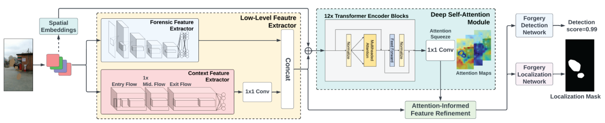

# VideoFACT (WACV 2024): Detecting Video Forgeries Using Attention, Scene Context, and Forensic Traces


[[Paper](https://openaccess.thecvf.com/content/WACV2024/papers/Nguyen_VideoFACT_Detecting_Video_Forgeries_Using_Attention_Scene_Context_and_Forensic_WACV_2024_paper.pdf)]
[[Supplemental](https://openaccess.thecvf.com/content/WACV2024/supplemental/Nguyen_VideoFACT_Detecting_Video_WACV_2024_supplemental.pdf)]
[[Poster](readme/poster.png)]
[[Presentation](readme/presentation.pdf)]


## News
- *2024.01.06:* Our code for inference is released.

## Overview


## Work in Progress
- [ ] Dataset Publication
- [ ] Training Code
- [ ] Evaluation Code

## Dependencies and Installation

1. Clone Repo

   ```bash
   git clone https://github.com/ductai199x/videofact-wacv-2024.git
   ```

2. Create Virtual Environment and Install Dependencies

    With virtualenv:
    ```bash
    virtualenv .venv --python=python3.9
    source .venv/bin/activate
    ```
    With conda:
    ```bash
    conda create -n videofact python=3.9
    conda activate videofact
    ```
    Install dependencies:
    ```bash
    pip install -r requirements.txt
    ```

## Get Started
### Prepare pretrained models
Before performing the following steps, please download our pretrained models first.

[[VideoFACT Xfer](https://www.dropbox.com/scl/fi/exkdmmp2krsbkc5fblld7/videofact_xfer.ckpt?rlkey=g52xhouc3h2yqrb5l2gfloiq7&dl=0)]
[[VideoFACT Deepfake](https://www.dropbox.com/scl/fi/euwth7njdi3nj3wi7o8zu/videofact_df.ckpt?rlkey=hwruc4bui47giukx5urlf1p5j&dl=0)]

### Run the demo
```bash
python demo.py
```

## Citation
If you find our work useful in your research, please consider citing:
```
@inproceedings{nguyen2024videofact,
  title={VideoFACT: Detecting video forgeries using attention, scene context, and forensic traces},
  author={Nguyen, Tai D and Fang, Shengbang and Stamm, Matthew C},
  booktitle={Proceedings of the IEEE/CVF Winter Conference on Applications of Computer Vision},
  pages={8563--8573},
  year={2024}
}
```

## License
Licensed under a [Creative Commons Attribution-NonCommercial 4.0 International](https://creativecommons.org/licenses/by-nc/4.0/) for Non-commercial use only.
Any commercial use should get formal permission first.